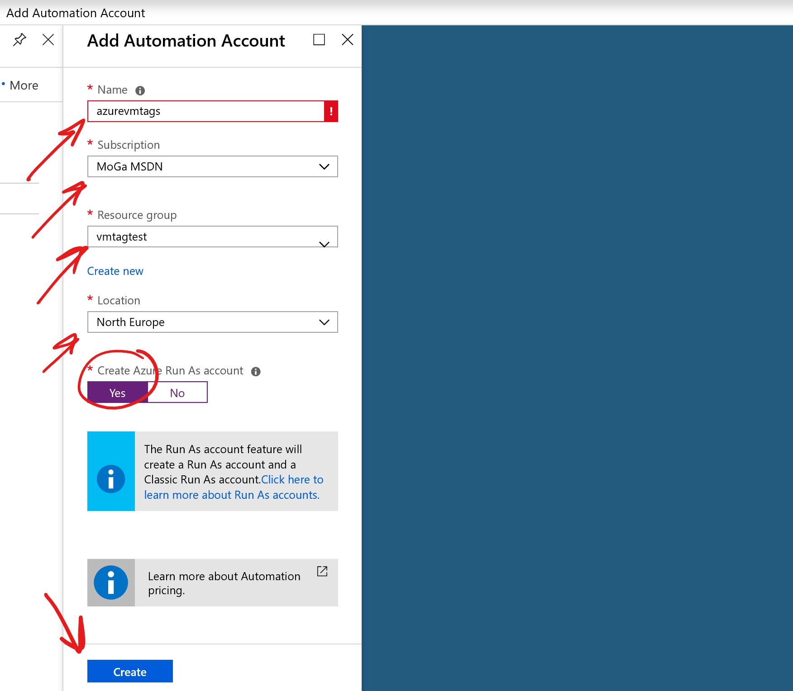

# Azure Automation to Tag all VMs in all subscriptions with the Creator username

e.g. CreatedBy : username@domain.com

## Why would you need that?
If anyone creates a VM, the creator username will be logged in the Activity log for 90 days, after that you won't know who created the VM.
If you schdule this script to run periodially (at most every 89 days) you can always maintain the creator information

## How to use

### Create a user account
You need to a add a user to be used for this Automation. The account running the script in Azure Automtion has to have the needed permissions to read VMs and add Tags to VMs.

Here is a step by step on how to create an Azure AD User: 
    https://docs.microsoft.com/en-us/azure/active-directory/fundamentals/add-users-azure-active-directory#add-a-new-user

Here is a step by step article on how to give an account a specific role:
    https://docs.microsoft.com/en-us/azure/role-based-access-control/role-assignments-portal#add-a-role-assignment

Please login with the user one time to make sure its working, in most cases you will need to change the password on the first login (will be needed below)

### Create an Automation Account

Now you need to create an Azure Automation Account.

Click on "All services" then type "auto" and choose "Automation Account"

Click "Add"

Choose a name, a subscription, Resrouce Group, Location and the Run As account has to be set to "Yes"

You may need to hit "Refresh"

Click to open the new Automation Account

Click on Modules Gallery on the left, search for "AzureRm.Profile" click on it and import it. You need to do the same for "AzureRm.Insights" module as well.

Its a good idea to update your Azure Automation Modules
https://docs.microsoft.com/en-us/azure/automation/automation-update-azure-modules#updating-azure-modules

Now go back to your Automation Account, click on "Credentials" and then "Add a credential"

Here you will need to add the user account that you have created above, and type the password you have created above 2 times. Also make sure to note the Name (not the username) as you will need to add it to the script.

Once done, go to "Runbooks" and click to add a new Runbook, that will be our code.

Click "Quick Create", choose a name and "Powershell" as the type and then click create.

Now you need to past the code from the PS script in this Repo, however make sure to change marked with red pointer (see screen shot below)

1.This is optional, you can change this if you like to change the Key of the Tag. Please don't change it form time to time as this will result adding many tags with the same info.

2.Here you need to add the "Name" (not the username) of the user to run the script
    

Then press "Save" then "Publish"

Now you can press Start to test it, then go to Jobs to check it. You can schdule it also if needed.

Best of Luck

Please feel free to open an issue or a pull request if needed

MoGa
